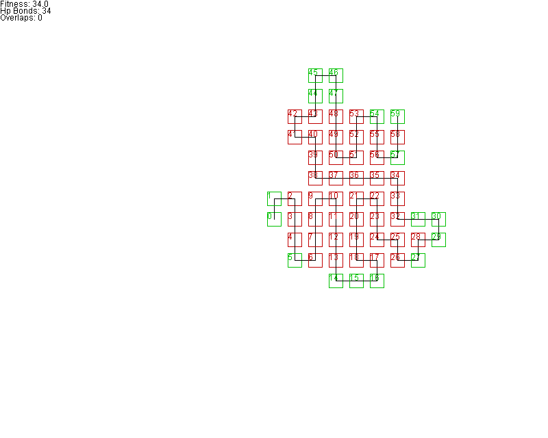
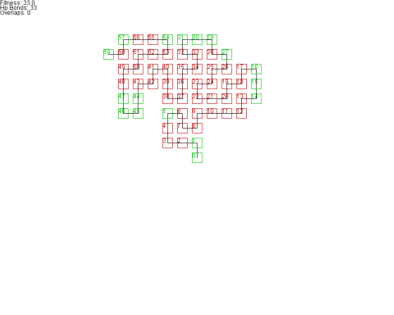
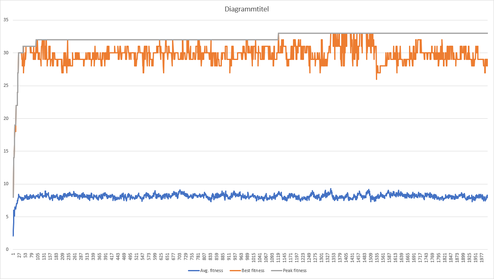

# Genetic Algorithm
This program was written for the "Genetische Algorithmen" ("Genetic Algorithms")
lab of the Hochschule Darmstadt University of Applied Sciences (H_DA).

## Autor
Jan Parisek (734059)  
2022-01-31

## Results
Reference specs: i7-4790K, DDR3-1600 memory

### Average results
Usually above 30.
Around 7-8 seconds.

### Best run
The following candidate was achieved within 7.6 seconds.

*Rendering of the best candidate.*

### Parameters
All candidates were achieved with the following settings:
* 2000 generations
* 1000 candidates
* Sequence `SEQ60`
* 1.25 mutation base rate
* 125 Crossover operations per generation
* Tournament selection
  * 10 candidates per tournament
* Intra-generational genetic diversity dynamic mutation modifier

### Final lab presentation
The following candidate was achieved within 15 seconds.

*Rendering of the best candidate.*

*Plot of fitness values.*

## Configuration
* The `Settings` class can be used to make adjustments to the algorithm.
* The `Examples` class can be used to add custom sequences.
* Results are put into the `./docs/` directory.

The code itself may be changed at your own discretion.

## How this works
### Main program
1. The protein sequence specified in `Settings` gets parsed from `Examples` into a `Sequence` instance.
2. 100 `Protein`s are created and put into a `Population`, representing a generation. Each one with a random genotype aka folding sequence.
3. A `Protein` consists of multiple `Aminoacid`s. Each `Aminoacid` contains its own value (hydrophobic or hydrophilic) and a cached position. The latter was done for performance optimization.
4. The current population has several of its candidates selected and even duplicated. After that random mutations and crossovers may happen.
5. The current generation's data gets logged with the `Logger` class.
6. Finally, the best candidate is rendered by the `Renderer` class.

### Selection algorithms
#### Fitness proportional selection
1. All `Protein`s of one generation are put into List consisting of pairs.
2. Each pair consists of a fitness value and the `Protein` object.
3. The total fitness of all `Protein`s is added together and used to normalize the fitness of each `Protein` so they add up to a value of 1.0.
4. The List of pairs gets populated. The fitness value of each pair consists of the previous pair's fitness value plus the attached `Protein`s fitness value. This represents a chain with increasing fitness values.
5. A random double value between 0 and 1 is chosen.

#### Tournament selection *\[Best]*
1. A number of `Protein`s is selected at random from the old generation.
2. The best `Protein` from that selection is added to the next generation.

### Mutation rate algorithm
These algorithms dynamically adjust the mutation rate by acting as a multiplier.

#### Intra-generational genetic diversity *\[Best]*
1. The first gene of every `Protein` is counted and stored in a map.
2. The most dominant gene is looked at.
3. The count of the most dominant gene is mapped from between its theoretical minimum and maximum to a value between 0 and 1. The more the first genes of all `Protein`s differ, the lower the value. The more the first genes of all `Protein`s are similar, the higher the value. This value represents the diversity of the first gene in a generation.
4. Repeat steps 1-3 for the remaining genes. Add the diversity of all genes into a total diversity.

Oddly enough, this value always seems to not vary as much as expected.

#### Inter-generational fitness variance
1. The fitness values of the most recent generations are stored in a queue.
2. The fitness of the past generations gets averaged.
3. The deviation from the average (mean) fitness gets calculated for each candidate.
4. The deviations of all candidates are added together into a total variance. The higher the value, the higher the variance. The lower the value, the lower the variance.
5. Invert total variance.

#### Cyclic
Simple sinusoidal mutation rate

## Performance
Great care was put into optimizing the run time of this program.

### Folding
Many `Proteins` with a potentially bad score can be avoided by not allowing amino acids to be placed on the previous coordinate. This is done by encoding proteins with the values `LEFT`, `RIGHT` and `FORWARD` (3 local directions) rather than global (4) directions.

### Caching
`Aminoacid`s store their own position. The position is calculated before evaluating the fitness. This means the position does not need to be re-calculated when comparing `Aminoacid`.

### Fitness function
* One `Aminoacid` is always skipped. This means that the `Aminoacid` currently looked at is never compared to its direct successor. This can be done without error, since we don't run the risk of overlapping with local directions. This improves performance from O(n^2-n/2) to O(n^2-(n-1)).
* Neighbors / overlapping is determined by calculating the "Manhattan distance" between `Aminoacid`s. If the distance is above 2, it means we can skip a couple checks because the next `Aminoacid`s might be too far away for comparisons to matter. This check was placed first, since `Aminoacids` are more likely to be further apart than next to each other or overlapping. If they're far apart, no further evaluations need to happen.

### Classes
All classes were constructed to be as lightweight as possible. The less there is to copy, the faster everything performs.

### Multithreading
The fitness evaluation of `Protein`s within one generation is handled concurrently by multiple threads.

## TODO
### Mutation base rate
This part of the code needs improvement, since it's a bit messy.

### Comments
Yeah, it should be readable.
